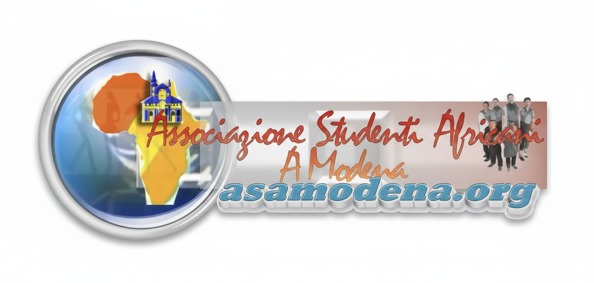

# 🌍 ASAM — African Students Association of Modena

Official website of the African Students Association of Modena, Italy.



## ✨ Features

- **Modern, refined design** — elegant interface with glassmorphism effects
- **African-inspired palette** — pan-African colours in a premium treatment
- **Premium typography** — Poppins with generous spacing and strong readability
- **Smooth animations** — micro-interactions and cubic-bezier transitions
- **Advanced visual effects** — blur, gradient overlays and a shadow elevation system
- **Fully responsive** — optimised for desktop, tablet and mobile
- **Membership system** — registration form with automatic email submission
- **Social media integration** — direct links to Instagram and the WhatsApp group
- **High performance** — static HTML/CSS/JS for very fast loading
- **SEO friendly** — optimised meta tags

## 📄 Pages

| Page | Purpose |
|---|---|
| `index.html` | Home — association overview, values, statistics and call to action |
| `about.html` | About us — history, mission and executive committee |
| `blog.html` | Blog — community articles and reflections |
| `gallery.html` | Photo gallery (work in progress) |
| `news.html` | News — ASAM 2026 membership announcement |
| `contact.html` | Contact details and form |
| `membership.html` | Membership registration form |

## 🎨 Executive committee

### Kamdem Cyrille — President
Third-year BSc student in Computer Engineering, Politecnico di Modena
> *"Ridare un interesse notevole al nostro patrimonio comune e costruire insieme la forza della nostra comunità"*

### Kenfack Kana Brayol — Vice President
Second-year BSc student in Computer Engineering, Politecnico di Modena
> *"Attraverso l'ASAM, desidero creare opportunità per ogni studente, affinché nessuno resti indietro nel percorso verso i propri sogni."*

### Nguesop Rodaise Darison — Treasurer
Second-year BSc student in Computer Engineering, Politecnico di Modena
> *"Gestire le risorse dell'ASAM significa investire nel futuro della nostra comunità e garantire che ogni progetto diventi realtà."*

### Awoumou M. Serge A. — General Secretary
MSc student in Economics, Public Policy and Sustainability, University of Modena
> *"Il mio più grande desiderio è che, attraverso l'ASAM, ogni voce venga ascoltata e ogni storia possa contribuire alla crescita della nostra famiglia."*

*Quotes are kept in the original Italian, as given by their authors.*

## 🤝 Partners and sponsors

- **[UNIMORE](https://www.unimore.it/it)** — University of Modena and Reggio Emilia
- **[copy&co](https://modena.esn.it/?q=partners/copy-co-3)** — printing and copy services
- **[ETJCA](https://www.etjca.it)** — recruitment and placement agency
- **[ER.GO](https://www.er-go.it)** — regional agency for the right to higher education

The sponsors section appears on every page, with greyscale logos that gain colour
and zoom on hover, linking directly to each partner's site.

## 💳 ASAM 2026 membership

**Fees**

| Category | Fee |
|---|---|
| First-year students | Free |
| Other students | €25/year (€10 membership card + €15 annual) |

**Member benefits**

- Free peer advice and guidance
- Full assistance with administrative paperwork
- Access to English and other courses organised by the association
- Academic support (study material grants)
- Cultural events — trips, tournaments, African cultural evenings
- Help finding accommodation and part-time work

## 🛠️ Built with

- **HTML5** — semantic structure
- **CSS3** — custom styling with CSS variables
- **Vanilla JavaScript** — interactive features
- **Font Awesome 6.4.0** — icon library
- **Google Fonts (Poppins)** — typography

## 🎨 Colour palette

Inspired by pan-Africanism, in a refined treatment:

| Colour | Primary | Light |
|---|---|---|
| African green | `#00693E` | `#00875A` |
| African gold | `#D4AF37` | `#F4D03F` |
| African red | `#8B1538` | `#A91D3A` |
| African orange | `#FF6B35` | — |

Neutrals run from `#1a1a1a` (dark text) through `#4a4a4a` and `#7a7a7a` to
`#fafafa` (off-white), with a four-level shadow elevation system (`sm`, `md`,
`lg`, `xl`).

## ⚡ Getting started

**Open directly** — double-click `index.html`.

**Local server** (recommended)

```bash
python3 -m http.server 8000
# then open http://localhost:8000
```

**Live Server** — install the Live Server extension in VS Code, then right-click
`index.html` → *Open with Live Server*.

## 📁 Project structure

```
.
├── index.html              # Home page
├── about.html              # About us and executive committee
├── blog.html               # Blog
├── gallery.html            # Photo gallery
├── news.html               # News and membership announcements
├── contact.html            # Contact page
├── membership.html         # Membership registration form
├── css/style.css           # Custom styling
├── js/main.js              # Main scripts
├── imagine_pagine/         # Hero section backgrounds
├── immagine_valori/        # Images for the association's values
├── photo_esecutivo/        # Executive committee photos
└── logo_sponsors/          # Sponsor logos
```

## 📞 Contact

**ASAM Modena**

- 📧 asamodena@gmail.com
- 📞 +39 333 789 5817
- 📍 Modena, Italy

**Social media**

- 📱 Instagram: [@asammodena](https://www.instagram.com/asammodena?igsh=emxzc2cxaDF4MGJ1)
- 💬 [WhatsApp group](https://chat.whatsapp.com/LfA2LtakzXz3R0LHKrM2OE?mode=wwt)

## 🚀 Deployment

Being a static site, it deploys anywhere. **GitHub Pages:** go to *Settings →
Pages*, select the `main` branch and the `/ (root)` folder. **Netlify:** connect
the repository for automatic deploys on every push. **Vercel:** run `vercel` from
the project root.

## 🔧 Customising

**Content** — edit the relevant HTML file directly: `index.html` for values and
statistics, `about.html` for the mission and committee, `news.html` for
announcements, `contact.html` for contact details.

**Colours** — edit the CSS variables under `:root` in `css/style.css`.

**Membership form** — the form in `membership.html` uses the `mailto:` protocol,
which opens the visitor's email client. For a more robust setup, consider a
backend API (Node.js, PHP, Python), an email service (SendGrid, Mailgun, Amazon
SES) or a form service (Formspree, Netlify Forms).

**Gallery** — the gallery page currently shows a placeholder. To add photos,
create `images/gallery/`, add the images and reference them from `gallery.html`.

## 📄 Licence

Created for ASAM, the African Students Association of Modena.

---

**Built with care by Colince Tcheussieu Mendji for the African community of Modena**
